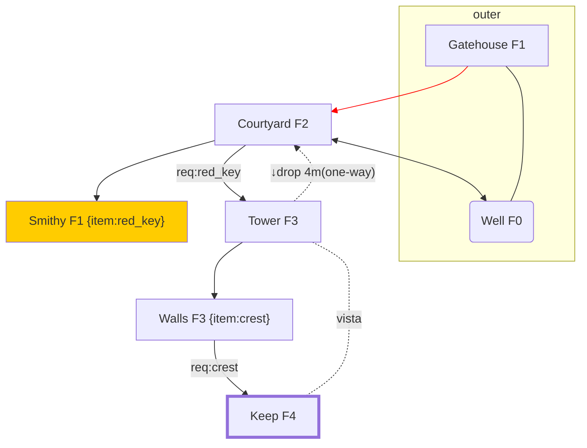

# Castle district topology

```mermaid
flowchart TD
  %% start: Gate
  %% goal: Keep
  classDef key fill:#fc0
  Gate["Gatehouse F1"] --> Court["Courtyard F2"]
  Court --> Smithy["Smithy F1 {item:red_key}"]
  Court -->|req:red_key| Tower["Tower F3"]
  Tower -.->|"↓drop 4m(one-way)"| Court
  Tower --> Walls["Walls F3 {item:crest}"]
  Walls -- req:crest --> Keep["Keep F4"]
  Tower -. vista .- Keep
  Court <--> Well(Well F0)
  subgraph outer
    Well --- Gate
  end
  class Smithy key;
  style Keep stroke-width:4px
  linkStyle 0 stroke:#f00
```
